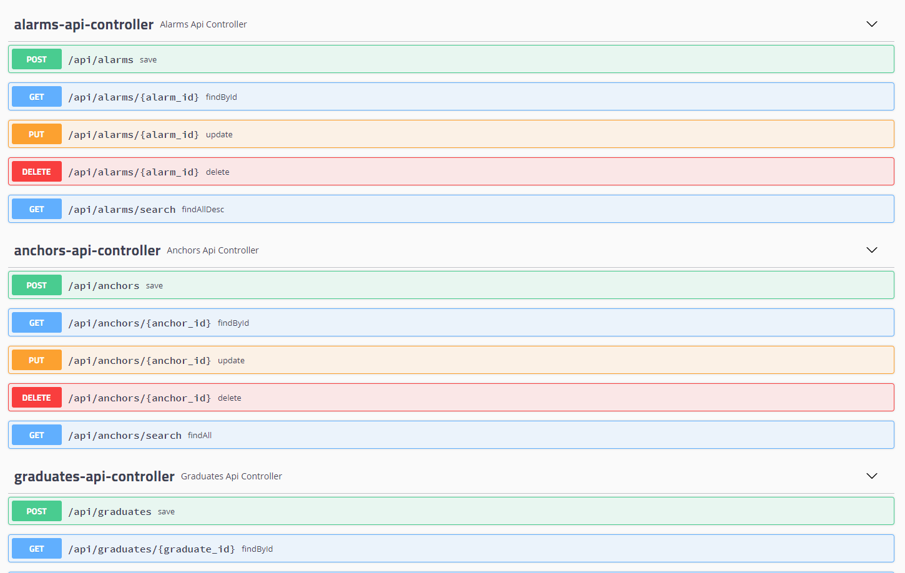
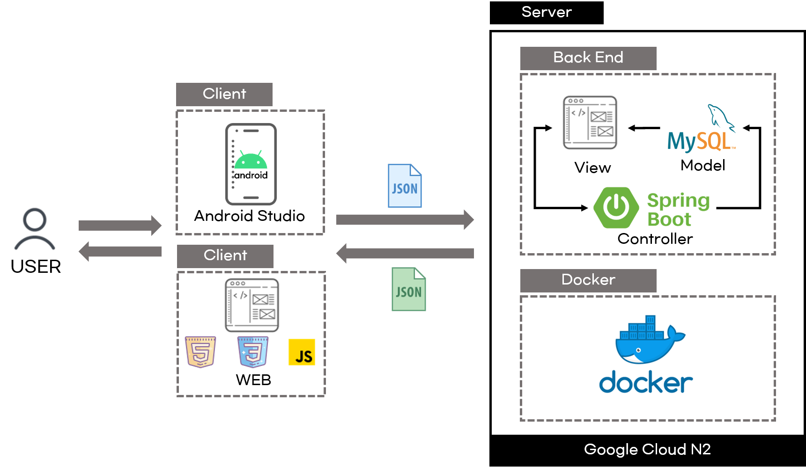

# Co-ARi Server
---
### Co-ARi
도메인 주소 : http://www.co-ari.o-r.kr:8080/
> 현재 구글 클라우드 서비스(GCP) 미 사용으로 인해 도메인 접근이 되지 않습니다.

- Co-ARi 프로젝트 목표 : 대면 수업을 진행하지 못하는 학생들이 수업을 듣는 강의실을 찾지 못하는 문제점에 대해 AR 환경을 구성하여 학과 강의실(호실) 안내를 시각적으로 할 수 있도록 하고, 정보 편차가 심한 문제점에 대해서는 필수 정보들을 한 플랫폼에 묶어서 일괄적으로 확인할 수 있게 구성하였다.

- Co-ARi Platform
  - Web : 정보 등록
    - 강의실(호실) 정보(앵커 위치) 등록
      - 클라이언트가 요청한 해당하는 강의실에 대한 정보를 제공하기 위해 강의실(호실) 정보를 등록한다.
    - 알림 등록
      - 관리자 권한으로, 알림을 작성할 경우 클라이언트에게 모두 전송된다.
    - 졸업 명예의 전당 등록
      - 관리자 권한으로, 졸업 관련된 정보를 작성할 경우 안드로이드 애플리케이션에 반영된다.
       
  - Android : 정보 요청
    - 클라이언트가 요청 시 해당 요청 정보에 맞는 API를 제공한다.

### API 명세서
- http://co-ari.o-r.kr:8080/swagger-ui.html
> 현재 구글 클라우드 서비스(GCP) 미 사용으로 인해 도메인 접근이 되지 않습니다.
  - 알림 API [Alarms]
  - 호실 정보 (앵커) API [Anchors]
  - 졸업 명예의 전당 API [Graduates]
  - 공지사항 API [Notices]
  - 학과소식 API [News]
  - 사용자 API [Users]
 

### 서버 아키텍처 구조
- MVC 패턴을 적용하여 서버를 구현하였다. 

### Spring Boot 내부 Package 구조
- Domain
  - DataBase를 처리하기 위한 DB 테이블과 동일한 객체를 관리하는 클래스 Package 
- DTO (Web/dto)
  - 데이터 전달 객체 Package (Domain과 매우 유사하나 외부에서 필요한 정보를 전달하며 DB와 근접한 Domain이 손상되지 않도록 분리시켜 사용하였다.)
- Service
  - 실제 로직을 수행하는 클래스 Package
- Controller (Web/Conroller)
  - Client 요청을 받아 학과 관련 정보를 제공하거나 해당 Requestmapping을 수행하고 응답을 전달하는 클래스 Package
- Crawler 
  - 학교 홈페이지에서 크롤링하여 정보를 제공하기 위한 클래스 Package
